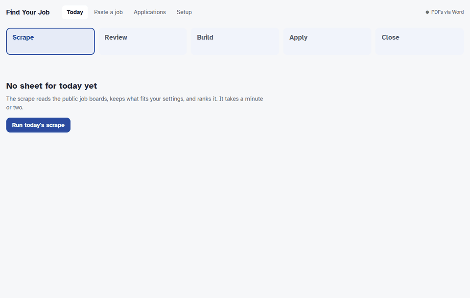

# jobHunt

Find job postings that fit you, build a CV tailored to each one, and keep track of every
application - from a page in your browser, on your own computer. Free, and nothing leaves
your machine unless you choose to use an AI verdict with your own key.

A free, local alternative to paid job-hunt tools like Teal, Jobscan or Huntr: no account, no
subscription, and your CV never goes to anyone's server.



<sub>The demo runs on the made-up person in the example files.</sub>

- **Finds leads** from public job boards (RemoteOK, Remotive, We Work Remotely,
  Himalayas, and company boards on Greenhouse, Lever and Ashby), and ranks them against what
  you told it you want.
- **Builds a tailored CV** for each posting you keep, from one set of facts about you, and
  holds it to two pages.
- **Tracks every application** - applied, interviewing, quiet for two weeks - in one place.

**What it doesn't do:** it never applies for you. You read each posting, you decide, you
click apply. It's a tool for sending fewer, better applications, not a mass-apply bot.

**Best for** tech and remote jobs, since that's what those boards list. Postings from anywhere
else (LinkedIn, a referral) can be pasted in by hand.

## Get started

1. **Install Python 3.10 or newer** from [python.org](https://www.python.org/downloads/).
   On Windows, tick **"Add python.exe to PATH"** in the installer.
2. **Get jobHunt:** click the green **Code** button on this page, then
   **Download ZIP**, and unzip it somewhere you'll find it again (Documents is fine).
   Or, if you use git: `git clone` this repository.
3. **Start it:**
   - **Windows:** double-click `start.bat`
   - **macOS:** double-click `start.command`
   - **Linux:** run `./start.sh` in a terminal

The first start takes a minute to set itself up, then your browser opens on **Setup**: a
short form creates your CV profile, and three more describe what you are looking for. After
that, **Today** walks you through the daily loop. Next time, just double-click again. To stop
it, close the window that opened with it.

**If your computer warns you** about running the file: on Windows click **More info → Run
anyway**; on macOS right-click `start.command`, choose **Open**, then **Open** again. Both
appear only because the file came from the internet.

**Optional extras:**
- **PDF CVs:** Microsoft Word (Windows) or the free [LibreOffice](https://www.libreoffice.org/download/download/).
  Without either you get Word documents, and the two-page check is skipped.
- **An AI second opinion** on postings you paste in: see [jobs/README.md](jobs/README.md#the-verdict-apply-consider-or-skip).

**Your data stays in this folder** - your CV facts, your applications, the day's leads. To
update the app, `git pull` if you cloned it; if you downloaded a ZIP, unzip the new version and
copy these across from the old folder: `cv/profile.json`, `jobs/settings.json`,
`jobs/priorities.md`, `cv/rules.md`, `applications.json` and the `applications/` folder.

## What's inside

A job-hunt toolchain in three parts, each usable on its own:

| Part | What it does |
|---|---|
| **`jobtrack`** | A dependency-free CLI for tracking applications. One plain JSON file — greppable, diffable, easy to back up. |
| **[`cv/`](cv/README.md)** | Generates tailored CV variants (DOCX + PDF) from one `profile.json`. Facts live once; each variant pulls the bullets tagged for it. |
| **[`jobs/`](jobs/README.md)** | Scrapes public job APIs, ranks the results against your priorities, and feeds the ones you pick into `jobtrack` with a CV built for each. |

Nothing here needs a paid service, and the runtime is standard library only. The one
exception is opt-in: `jobs.paste` can ask an LLM of your choice for a verdict on a job
description, with your own API key.

## Setting it up by hand

`start.bat` / `start.sh` do all of this for you. The rest of this section is for anyone who
prefers the command line.

Everything personal — your CV data, your applications, the day's leads — is gitignored.
A fresh clone has the tools and none of the contents, so start by making your own.

**The easy way:** run `python -m jobs.ui` (after the `pip install` below). The page opens on
**Setup** when nothing is set up yet: a short guided form creates your CV profile, and the
other three files start from the examples and are edited as forms. Every save is checked
first, and the previous version is kept as a `.bak` next to the file.

**The command-line way:**

```bash
python -m venv .venv
source .venv/bin/activate      # Windows: .venv\Scripts\activate
pip install -e ".[dev,pdf]"

python cv/init.py              # interviews you, writes cv/profile.json
python cv/build.py             # renders it -> cv/out/<folder>/<name>.pdf

cp jobs/settings.example.json jobs/settings.json   # then rewrite all three as your own
cp jobs/priorities.example.md jobs/priorities.md
cp cv/rules.example.md cv/rules.md
```

Prefer editing JSON to answering an interview? `cp cv/profile.example.json cv/profile.json`
instead of running `init.py` — it is a complete annotated template that builds all eight
variants as-is, so you can replace the placeholder content a block at a time and see the
result after each pass. It also shows the optional keys `init.py` never asks about.

`profile.json` holds your facts. `settings.json` holds what you are looking for — where
you live and may work, the roles you want at which seniority, what earns a bonus — and is
what the scrape ranks against. `priorities.md` and `rules.md` hold the judgement no rule can:
which postings are worth an application, and what may be claimed on the CV. All four are
gitignored. The `/jobhunt` loop reads the last two before triaging a single lead.

`cv/init.py` asks for what is already on your CV — contact details, headline, summary,
skill groups, roles and bullets, education — and writes a `profile.json` that builds
straight away. Ten minutes, and the result is a text file you can keep editing.
It will not overwrite an existing profile without `--force`.

`pdf` pulls in pywin32, which `cv/` needs to export PDFs through Word and to check the
two-page rule. Skip it and the CV builders stop at `.docx`.

Before using `jobs/`, read [jobs/README.md](jobs/README.md#making-it-yours). Until you
write `jobs/settings.json` the scrape ranks leads for the made-up person in the example —
it says so on every run — and every `cv` a role there names must be a variant in your
`profile.json`.

## Using the web page

Everything the daily loop does from the command line also runs from a page in your browser:

```bash
python -m jobs.ui
```

It opens `http://127.0.0.1:8765/` and walks through the day in five steps - **Scrape**,
**Review** (tick leads with `x`, drop them with `-`, move with `j`/`k`), **Build** the CVs,
**Apply**, and **Close** the day - opening on the step you are at. **Paste a job** takes a
posting the scrape never saw. Each CV has **Open** and **Show in folder**, for attaching it to
an application form. **Applications** lists everything you have tracked - filter, search, edit,
add notes, export to CSV - and flags open applications that have gone quiet for two weeks, with
one-click **No reply** and **Heard back**. **Setup** edits your four personal files as forms.

Only your own computer can reach the page; press Ctrl+C in its window to stop it. The page and
the command line work on the same files, so you can switch between them in the middle of a
day. `--port 9000` picks another port, `--no-browser` only prints the address.

## Tracking applications

```bash
jobtrack add "Acme Corp" "Backend Engineer" --location Remote --url https://...
jobtrack list --open
jobtrack update 1 --status interviewing
jobtrack note 1 "Phone screen Tuesday 10am with Dana"
jobtrack show 1
jobtrack search acme
jobtrack stats
jobtrack export -o applications.csv
```

### Commands

| Command | Purpose |
| --- | --- |
| `add COMPANY ROLE` | Record a new application |
| `list` | Table view; `--open`, `--status X`, `--sort id\|company\|applied\|status` |
| `show ID` | Full detail including notes |
| `update ID` | Change status, dates, or any field |
| `note ID TEXT` | Append a timestamped-ish note |
| `rm ID` | Delete an application |
| `search TERM` | Free-text search across company, role, location, notes |
| `stats` | Pipeline breakdown and offer rate |
| `export` | CSV to stdout or `-o FILE` |

Statuses: `wishlist`, `applied`, `screening`, `interviewing`, `offer`, `rejected`,
`withdrawn`. Unambiguous prefixes work (`--status interview`).

## Data location

Defaults to `./applications.json`. Override with `--file PATH` or the `JOBTRACK_FILE`
environment variable.

## Development

```bash
pytest
ruff check . && ruff format --check .
```

The suite needs no personal files — it builds its CVs from fixtures, so it passes on a
fresh clone before you have run `cv/init.py`.

See `CLAUDE.md` for architecture notes and conventions.
